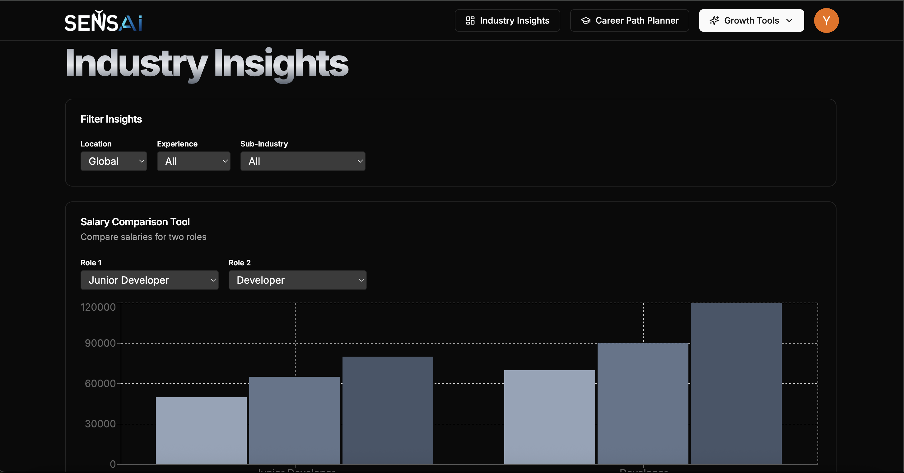
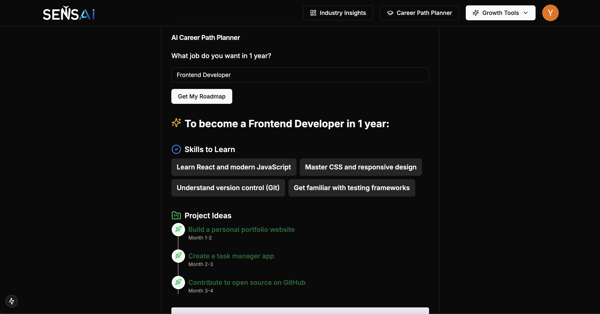
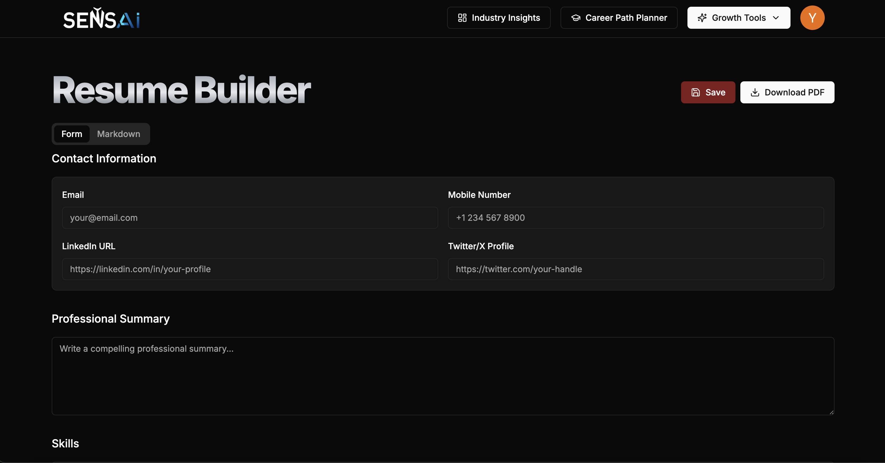

# SENSAi – AI Career Coaching Platform

SENSAi is a full-stack AI-powered career assistant that helps users create professional resumes, plan their career paths, close skill gaps, and gain valuable job market insights — all powered by Google Gemini and modern web technologies.

---

## 🔥 Features

* ✅ **AI Resume Builder** – Create and edit resumes via form or Markdown and export them as PDF
* ✅ **AI Career Path Planner** – Get personalized roadmaps for your target job role
* ✅ **Skill Gap Analysis** – Compare your skills against job requirements and get recommendations
* ✅ **Industry Insights** – View trending roles, skill demand, and job patterns
* ✅ **Salary Comparison** – Understand regional salary trends for various job titles
* ✅ **Growth Tools** – Includes job description tailoring, resume feedback, and skill suggestions
* ✅ **Career News Feed** – Stay updated with tech and career news curated by AI
* ✅ **PDF Export** – Download polished resumes in one click
* ✅ **Clerk Auth Integration** – Secure authentication system
* ✅ **Mobile Responsive UI** – Built with Tailwind and Shadcn UI for a clean UX

---

## 🧰 Tech Stack

| Tech                        | Purpose                                 |
| --------------------------- | --------------------------------------- |
| **Next.js 14 App Router**   | Frontend and API routes                 |
| **TailwindCSS + Shadcn UI** | Modern, customizable UI                 |
| **Prisma + NeonDB**         | Database ORM and storage                |
| **Clerk**                   | Authentication                          |
| **Google Gemini API**       | LLM-based AI functionality              |
| **Inngest**                 | Background job scheduling and execution |
| **React Markdown**          | Rich Markdown editing and previews      |

---

## 📸 Screenshots






---

## 🛠️ Getting Started

### 1. Clone the repository

```bash
git clone https://github.com/YOUR_USERNAME/sensai.git
cd sensai
```

### 2. Install dependencies

```bash
npm install
```

### 3. Set up environment variables

Create a `.env` file based on `.env.example`:

```env
DATABASE_URL=
CLERK_SECRET_KEY=
CLERK_PUBLISHABLE_KEY=
GOOGLE_GEMINI_API_KEY=
```

### 4. Push Prisma schema to your DB

```bash
npx prisma db push
```

### 5. Run the app

```bash
npm run dev
```

---

## 📄 License

This project is for educational and portfolio purposes only.
